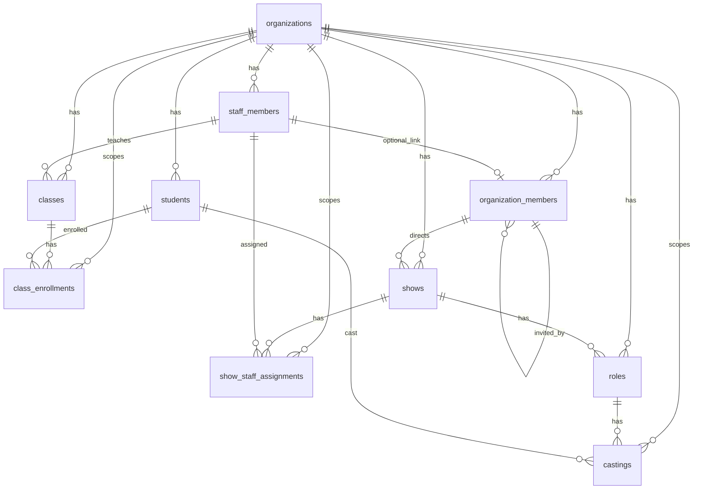

# Data Model

Sources:

- `database/schema.sql`
- `database/add_user_profiles.sql`
- `database/populate_user_profiles.sql`

## Entities and Relations

## Table Summary

- `organizations`
  - Tenant root
  - `slug` unique
- `organization_members`
  - membership of auth user inside organization
  - role enum-like check: `admin|teacher|staff`
  - unique `(organization_id, user_id)`
  - optional `staff_member_id -> staff_members.id` (`ON DELETE SET NULL`)
  - unique partial index `(organization_id, staff_member_id)` where `staff_member_id is not null`
- `students`
  - student profile + contact/medical notes
- `classes`
  - class metadata + schedule JSONB + `teacher_id`
  - `teacher_id -> staff_members.id` (set null on delete)
- `class_enrollments`
  - m:n students/classes with status
  - unique `(class_id, student_id)`
- `shows`
  - show/production aggregate with status and director
- `staff_members`
  - staff catalog per organization (role taxonomy in check constraint)
- `show_staff_assignments`
  - m:n shows/staff with per-show role
  - unique `(show_id, staff_member_id)`
- `roles`
  - theatrical roles/characters per show
- `castings`
  - m:n role/student assignments
  - unique `(role_id, student_id)`
- `user_profiles` (from separate SQL)
  - profile mirror table keyed by `auth.users.id`

## Key Constraints

- Primary keys: UUID with `uuid_generate_v4()`
- Foreign keys:
  - most tables reference `organizations(id)` with cascade delete
  - `classes.teacher_id -> staff_members(id)` with `ON DELETE SET NULL`
  - `shows.director_id -> organization_members(id)`
  - `show_staff_assignments` references `shows` and `staff_members`
  - `roles.show_id -> shows(id)`
  - `castings.role_id -> roles(id)`, `castings.student_id -> students(id)`
- Uniques:
  - `organizations.slug`
  - `organization_members(organization_id, user_id)`
  - partial unique `organization_members(organization_id, staff_member_id)` when linked
  - `class_enrollments(class_id, student_id)`
  - `show_staff_assignments(show_id, staff_member_id)`
  - `castings(role_id, student_id)`
- Cross-tenant guard:
  - trigger `validate_organization_member_staff_link()` enforces that linked `staff_member_id` belongs to same `organization_id`

## Soft Delete / Lifecycle

- No hard soft-delete columns like `deleted_at` were found.
- Lifecycle is modeled with `is_active` booleans and status fields:
  - organizations/students/classes/shows/staff_members: `is_active`
  - enrollments/castings/shows: status enums

## RLS Notes

RLS is enabled for core tables in `database/rls-policies.sql`.

Important:

- `organization_members` is now policy-scoped for tenant safety:
  - admins can read/manage members in their organization
  - non-admin users can read only their own membership row

## Missing / Assumptions

- No explicit migration version table found (manual SQL application assumed).
- No seed for full demo domain data in repo (only profile population helper).
